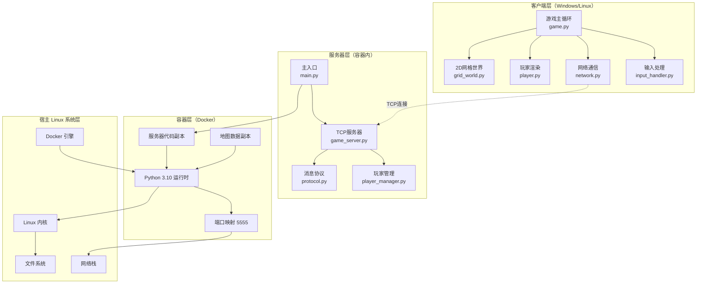
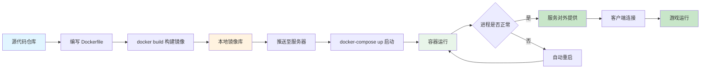
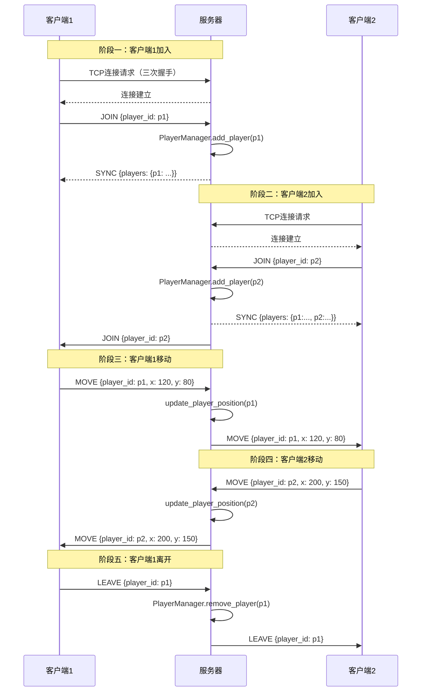

# 基于 Linux 的容器化多人联机游戏服务器设计与实现

## 一、总述

随着互联网游戏产业的快速发展，多人在线游戏对服务器端的部署效率、运行稳定性以及跨平台协同能力提出了日益严苛的要求。Linux 凭借其出色的网络性能、稳定的进程管理机制以及丰富的容器化生态，已成为游戏服务器部署的首选操作系统。然而，传统的游戏服务器部署方式长期受困于环境依赖冲突、部署流程不可复现以及故障恢复迟缓等工程难题，严重制约了开发与运维的效率。

本报告针对上述问题，设计并实现了一套基于 Linux 环境的容器化多人联机游戏服务器系统。该系统以 Python 语言为核心开发语言，采用 TCP Socket 实现可靠的实时通信，通过多线程并发模型处理多客户端连接，并借助 Docker 容器技术实现服务器环境的高度封装与一键部署。客户端基于 pygame 图形库构建 2D 游戏世界，支持 WASD 自由移动、墙体碰撞检测以及多玩家实时状态同步。

本项目的核心创新点体现在三个层面。
其一，在部署层面，通过 Dockerfile 与 docker-compose.yml 将服务器运行环境、依赖配置、网络端口映射等要素进行声明式封装，实现了"一次构建，到处运行"的环境一致性目标，从根本上解决了 Linux 发行版多样性带来的依赖地狱问题。
其二，在通信层面，设计了一套基于 JSON 的轻量级消息协议，涵盖 JOIN、LEAVE、MOVE、SYNC 四类消息类型，并以换行符作为消息分隔符解决了 TCP 流式传输中的粘包问题。
其三，在运维层面，借助 docker-compose 的 restart 策略实现了服务器进程的自动恢复，显著提升了系统的可用性。

整体而言，本项目不仅完成了一个具备实际可玩性的多人联机游戏 demo，更重要的是探索并验证了"Linux + Docker + Python Socket"这一技术组合在轻量级游戏服务器领域的工程可行性，为类似规模的网络应用部署提供了可复用的参考范式。

## 二、问题描述

### 2.1 问题发现方式

本报告所关注的问题源于对中小型多人在线游戏服务器部署实践的调研与观察。在查阅 GitHub 上若干开源 2D 多人游戏项目的过程中，我们发现一个普遍存在的现象：绝大多数项目将注意力集中于游戏逻辑与画面表现的设计，而服务器端的部署文档往往寥寥数语，通常仅以一句"安装 Python 依赖后运行 main.py"草草带过。这种重开发、轻部署的倾向，使得项目在实际迁移至 Linux 生产环境时频繁遭遇各类环境相关问题。

进一步的调研显示，在 Stack Overflow 与各大技术社区中，关于"Python 游戏服务器在 Linux 上无法启动""pygame 依赖在无图形界面的服务器上安装失败""多客户端连接不稳定"等问题的求助帖子屡见不鲜。这些现象表明，Linux 环境下游戏服务器的部署与运行并非如想象中那般顺遂，而是一个值得深入挖掘的工程问题。

### 2.2 问题背景

在深入分析之前，有必要梳理传统 Linux 游戏服务器部署所面临的三大核心痛点。

**痛点一：环境依赖地狱（Dependency Hell）。** Linux 发行版众多，Ubuntu、CentOS、Debian、Arch 等发行版在默认 Python 版本、系统库版本以及包管理工具上存在显著差异。一个在 Ubuntu 22.04 上开发并正常运行的游戏服务器，迁移至 CentOS 8 时可能因 Python 版本不一致（如 3.10 与 3.6 的差异）而无法启动；即便 Python 版本一致，第三方库对不同系统底层 C 库的依赖也可能引发难以定位的动态链接错误。对于依赖图形库 pygame 的项目而言，问题更为棘手——pygame 在编译安装时需要 SDL2、freetype、libjpeg 等一系列系统级依赖，而无图形界面的 Linux 服务器往往默认未安装这些库，强行安装又会引入大量无关组件，污染系统环境。

**痛点二：部署流程不可复现。** 传统的部署方式高度依赖运维人员的手工操作：安装系统依赖、创建虚拟环境、克隆代码仓库、安装 Python 依赖、配置防火墙端口、设置开机自启脚本。这一系列步骤中任何一环的人工失误都可能导致部署失败，且不同运维人员的操作习惯差异使得同一项目在不同服务器上的部署结果难以保证一致。当服务器出现故障需要重新部署时，往往面临"上次是怎么配的"这一令人头疼的追溯难题。

**痛点三：故障恢复困难。** 游戏服务器作为长驻进程，其运行过程中可能因网络异常、内存泄漏、客户端恶意连接等多种原因崩溃。传统部署方式下，进程崩溃后无法自动恢复，需要运维人员介入手动重启，故障期间的玩家体验受到严重影响。虽然可通过 systemd 等系统级服务管理工具实现一定程度的自动重启，但其配置相对复杂，且无法与部署环境深度集成。

### 2.3 问题现状

下表对传统部署方式与容器化部署方式在关键维度上进行了对比：

| 对比维度 | 传统部署方式 | 容器化部署方式 |
|---------|------------|--------------|
| 环境一致性 | 差，受发行版影响 | 优，镜像层保证一致 |
| 部署耗时 | 长，约 15-30 分钟 | 短，约 1-2 分钟 |
| 故障恢复 | 需人工介入 | 自动重启 |
| 环境隔离 | 弱，共享系统环境 | 强，namespace 隔离 |
| 可复现性 | 低，依赖人工记录 | 高，声明式配置 |

综上，本报告所要解决的核心问题可概括为：**如何为多人联机游戏服务器设计一套基于 Linux 与 Docker 的容器化部署方案，使其在保证实时通信性能与多客户端并发处理能力的前提下，实现环境的可复现部署、进程的自动恢复以及跨平台的一致运行。** 这一问题既具有现实的工程价值，也涉及 Linux 系统编程、网络编程与容器技术的多重知识体系，值得深入研究。

## 三、问题分析

### 3.1 问题产生的原因

上述部署痛点的产生有其深层的系统级原因。从 Linux 操作系统的角度来看，问题的根源在于"应用运行环境"与"宿主操作系统"之间的耦合过紧。Linux 的共享库机制（shared library）虽然提高了系统资源的利用率，但也使得应用程序的运行时行为依赖于宿主系统上特定版本的动态链接库。当应用程序在不同 Linux 发行版之间迁移时，即使内核版本相同，用户态库（如 glibc、libSDL2）的版本差异也可能导致运行失败。

从 Python 生态的角度来看，pygame 这类包含 C 扩展的库在安装时需要在目标系统上完成编译，而编译过程对系统级开发头文件（如 libsdl2-dev）有较强依赖。生产服务器通常不安装开发工具链，这导致部署时要么被迫安装大量开发包，要么需要在开发机上预编译 wheel 文件后传输，两种方式都增加了部署的复杂度。

从运维流程的角度来看，传统部署缺乏对"环境即代码"理念的应用。部署步骤以文档形式记录，而非以可执行的配置文件表达，导致环境配置无法纳入版本控制，无法进行差异比对，也无法实现自动化复现。

### 3.2 问题的影响

这些问题对游戏服务器的开发与运营产生多方面的负面影响。在开发效率方面，开发者不得不花费大量时间排查"在我机器上能跑"的环境差异问题，而非专注于游戏逻辑本身的优化。在运维成本方面，每新增一台服务器节点都需要重复执行繁琐的部署流程，且难以保证配置的一致性，长期累积下形成所谓"配置漂移"现象。在系统可用性方面，进程崩溃后的人工恢复窗口期可能长达数分钟，对于强调实时性的多人游戏而言，这一延迟足以造成大量玩家流失。在可扩展性方面，缺乏标准化的部署单元使得横向扩展（即通过增加服务器节点分担负载）难以实现，限制了系统的承载能力。

### 3.3 问题技术性分析

为深入理解上述问题并设计合理的解决方案，有必要对涉及的关键技术进行剖析。

**TCP Socket 通信原理。** 本项目选择 TCP 而非 UDP 作为传输层协议，主要基于两点考量。其一，TCP 提供面向连接的可靠传输，通过三次握手建立连接、序列号机制保证有序到达、ACK 确认与超时重传保证可靠性，这对于游戏中的玩家加入、离开等关键事件至关重要——这些事件若发生丢失将导致玩家状态不一致。其二，TCP 的流式传输特性要求应用层自行处理消息边界，即所谓"粘包"问题。本项目采用在每条 JSON 消息末尾追加换行符 `\n` 作为分隔符的方案，接收端通过缓冲区累积数据并以换行符切分，从而准确还原每条消息。这一方案实现简洁，且与 JSON 文本格式天然兼容。

**多线程并发模型。** 服务器采用"每连接一线程"（thread-per-connection）的并发模型。主线程负责通过 `socket.accept()` 阻塞等待新连接，每接收到一个新连接便派生一个工作线程专司该连接的消息收发。这一模型在连接数较小的场景下（本项目目标为 10 人以内的小型游戏房间）实现简单、调试方便，且 Python 的 GIL（全局解释器锁）在这一规模下并不会成为性能瓶颈。对于更大规模的并发场景，可平滑迁移至基于 `selectors` 模块的事件驱动模型或 asyncio 异步框架。

**JSON 消息协议设计。** 应用层协议定义了四类消息：JOIN（玩家加入）、LEAVE（玩家离开）、MOVE（位置更新）、SYNC（全局状态同步）。每条消息为一个 JSON 对象，包含 `type` 字段标识消息类型，其余字段携带具体载荷。这一设计的优势在于：JSON 文本格式人类可读，便于调试；自描述的结构使得协议易于扩展新消息类型；Python 标准库的 `json` 模块即可完成序列化与反序列化，无需引入额外依赖。

**Docker 容器隔离原理。** Docker 容器并非轻量级虚拟机，其隔离能力建立在 Linux 内核的两项关键技术之上。其一是 namespace（命名空间），包括 PID namespace（进程隔离）、NET namespace（网络隔离）、MNT namespace（挂载点隔离）等，使容器内的进程仿佛运行在独立的系统中。其二是 cgroup（控制组），用于限制容器进程可使用的 CPU、内存、网络带宽等资源，防止单一容器耗尽宿主资源。由于容器共享宿主内核，无需像虚拟机那样启动完整的客户机操作系统，因此启动速度可达秒级，资源开销远低于虚拟机。本项目利用 Docker 将游戏服务器及其运行环境封装为一个不可变镜像，从根源上消除了环境差异问题。

### 3.4 解决方案的价值

综合上述分析，本项目的解决方案在多个维度上具有显著价值。在工程价值方面，通过 Docker 镜像将环境配置固化，实现了部署的完全可复现性，任意一台安装 Docker 的 Linux 主机均可通过单条命令启动完全一致的游戏服务器。在运维价值方面，docker-compose 的 `restart: unless-stopped` 策略使得容器在异常退出时自动重启，故障恢复时间从分钟级缩短至秒级。在教育价值方面，本项目完整覆盖了 Linux 网络编程、多线程并发、容器化部署等核心知识点，是 Linux 系统课程内容的综合性实践。

## 四、工具设计与实现

### 4.1 系统功能架构

本系统采用经典的客户端-服务器（Client-Server）架构，整体分为四层：客户端层、服务器层、容器层与宿主 Linux 系统层。系统的整体功能架构如下图所示。



如图所示，客户端运行于 Windows 或 Linux 桌面环境，负责游戏画面的渲染与玩家输入的采集，通过 TCP 协议与服务器通信。服务器运行于 Docker 容器内部，承载游戏状态管理与消息广播的核心职责。容器层封装了 Python 运行时、服务器代码与地图数据，通过端口映射与宿主网络栈交互。宿主 Linux 系统层提供内核能力与 Docker 引擎支撑，是整个系统的运行基石。

### 4.2 模块说明

#### 4.2.1 服务器模块

服务器模块位于 [server/](file:///e:/大学作业/大二下已经变成纳垢信徒/Linux/final/server/) 目录下，由四个核心文件构成。

[server/main.py](file:///e:/大学作业/大二下已经变成纳垢信徒/Linux/final/server/main.py) 是服务器的主入口，负责创建 `GameServer` 实例并启动监听循环。其将绑定地址设为 `0.0.0.0`，意味着监听所有网络接口，从而允许容器外部的客户端通过端口映射接入。

[server/game_server.py](file:///e:/大学作业/大二下已经变成纳垢信徒/Linux/final/server/game_server.py) 实现了 TCP 服务器的核心逻辑，包括 socket 创建、地址绑定、连接监听、连接接收与消息分发。其采用双线程结构：主线程派生的 accept 线程循环接收新连接，每接到一个连接即派生一个 client 线程专门处理该连接的消息收发。

[server/player_manager.py](file:///e:/大学作业/大二下已经变成纳垢信徒/Linux/final/server/player_manager.py) 负责维护在线玩家的状态字典，包括玩家 ID、坐标位置与对应的 socket 连接对象，提供增删改查的完整接口。

[server/protocol.py](file:///e:/大学作业/大二下已经变成纳垢信徒/Linux/final/server/protocol.py) 定义了四类消息的构造函数，统一了消息格式，便于服务器与客户端的对称实现。

#### 4.2.2 客户端模块

客户端模块位于 [client/](file:///e:/大学作业/大二下已经变成纳垢信徒/Linux/final/client/) 目录下。

[client/game.py](file:///e:/大学作业/大二下已经变成纳垢信徒/Linux/final/client/game.py) 是客户端主程序，承载 pygame 主循环、事件处理、状态更新与画面渲染的职责。其通过独立的网络接收线程与主循环解耦，确保网络 IO 不阻塞画面刷新。

[client/network.py](file:///e:/大学作业/大二下已经变成纳垢信徒/Linux/final/client/network.py) 封装了 TCP 客户端逻辑，包括连接建立、消息发送、异步接收与队列缓冲。接收线程将收到的消息放入 `queue.Queue`，主循环通过非阻塞的 `get_messages()` 方法批量取出处理。

[client/player.py](file:///e:/大学作业/大二下已经变成纳垢信徒/Linux/final/client/player.py) 与 [client/input_handler.py](file:///e:/大学作业/大二下已经变成纳垢信徒/Linux/final/client/input_handler.py) 分别实现玩家实体的渲染与 WASD 键盘输入的向量化解码。

#### 4.2.3 容器化模块

[Dockerfile](file:///e:/大学作业/大二下已经变成纳垢信徒/Linux/final/Dockerfile) 基于 `python:3.10-slim` 镜像构建，仅复制服务器代码与地图数据，不包含客户端代码与 pygame 依赖，从而将镜像体积控制在最小。`PYTHONUNBUFFERED=1` 环境变量确保日志实时输出，便于调试。

[docker-compose.yml](file:///e:/大学作业/大二下已经变成纳垢信徒/Linux/final/docker-compose.yml) 声明了 game-server 服务，配置端口映射 `5555:5555`、自动重启策略 `unless-stopped`，并创建独立的 bridge 网络以隔离容器网络命名空间。

### 4.3 部署流程

从源代码到服务器上线运行的完整部署流程如下图所示。



如图所示，整个部署流程从源代码出发，经由 Dockerfile 的声明式描述，通过 `docker build` 命令构建为不可变镜像。镜像推送至服务器后，仅需执行 `docker-compose up -d` 一条命令即可启动服务。容器运行期间，docker-compose 守护进程持续监控容器状态，一旦检测到异常退出立即触发自动重启，保障服务的高可用性。客户端通过服务器的公网 IP 与映射端口接入游戏。

### 4.4 关键代码分析

#### 4.4.1 TCP 服务器启动与多线程处理

服务器启动逻辑位于 [server/game_server.py](file:///e:/大学作业/大二下已经变成纳垢信徒/Linux/final/server/game_server.py#L21-L47)。核心代码如下：

```python
def start(self):
    self.server_socket = socket.socket(socket.AF_INET, socket.SOCK_STREAM)
    self.server_socket.setsockopt(socket.SOL_SOCKET, socket.SO_REUSEADDR, 1)
    self.server_socket.bind((self.host, self.port))
    self.server_socket.listen(5)
    self.running = True
    accept_thread = threading.Thread(target=self._accept_loop, daemon=True)
    accept_thread.start()
```

此段代码体现了三个关键的 Linux 网络编程要点。其一，`SO_REUSEADDR` 选项的设置允许服务器在 TIME_WAIT 状态下快速重启复用端口，避免了"Address already in use"错误，这对容器化部署中频繁重启的场景尤为重要。其二，`listen(5)` 设定了连接队列长度为 5，表示在 accept 线程来不及处理时，内核可缓存最多 5 个已完成三次握手的连接。其三，accept 线程被标记为 `daemon=True`，确保主进程退出时所有工作线程自动终止，避免僵尸线程残留。

#### 4.4.2 JSON 消息协议与粘包处理

消息接收与解析逻辑位于 [server/game_server.py](file:///e:/大学作业/大二下已经变成纳垢信徒/Linux/final/server/game_server.py#L49-L76)。核心代码如下：

```python
def _handle_client(self, conn, addr):
    buffer = ""
    player_id = None
    try:
        while self.running:
            data = conn.recv(1024).decode('utf-8')
            if not data:
                break
            buffer += data
            while '\n' in buffer:
                line, buffer = buffer.split('\n', 1)
                try:
                    message = json.loads(line)
                    player_id = self._process_message(message, conn)
                except json.JSONDecodeError:
                    pass
```

此段代码解决了 TCP 流式传输的粘包问题。`recv(1024)` 每次最多读取 1024 字节，但所读取的数据可能包含半条消息、一条完整消息或多条消息的任意组合。通过维护一个 `buffer` 字符串累积接收数据，并以换行符 `\n` 为边界切分，可准确还原每条 JSON 消息。这种"缓冲区 + 分隔符"的模式是文本协议处理的经典范式，实现简洁且健壮。

#### 4.4.3 玩家状态广播机制

消息广播逻辑位于 [server/game_server.py](file:///e:/大学作业/大二下已经变成纳垢信徒/Linux/final/server/game_server.py#L113-L129)。核心代码如下：

```python
def _handle_player_move(self, player_id: str, x: float, y: float):
    self.player_manager.update_player_position(player_id, x, y)
    move_msg = create_move_message(player_id, x, y)
    self._broadcast(move_msg)

def _broadcast(self, message: Dict, exclude=None):
    for conn in self.player_manager.get_all_connections():
        if conn != exclude:
            self._send_to(conn, message)
```

每当某一玩家位置发生更新，服务器在更新本地状态后立即将该位置变更消息广播至所有在线玩家。`exclude` 参数的引入实现了"消息不回发给发送者"的优化，避免玩家收到自身位置的冗余反馈。这种"服务器权威 + 广播同步"的模式是状态同步类游戏的主流架构，保证了所有客户端观察到的一致性游戏世界。

#### 4.4.4 Dockerfile 构建优化

[Dockerfile](file:///e:/大学作业/大二下已经变成纳垢信徒/Linux/final/Dockerfile) 内容如下：

```dockerfile
FROM python:3.10-slim
WORKDIR /app
COPY server/ /app/server/
COPY data/ /app/data/
EXPOSE 5555
ENV PYTHONUNBUFFERED=1
CMD ["python", "server/main.py"]
```

该 Dockerfile 体现了若干构建优化考量。其一，选用 `python:3.10-slim` 而非完整版 `python:3.10` 镜像，去除不必要的编译工具与文档，将镜像体积从约 900MB 压缩至约 150MB。其二，仅复制 `server/` 与 `data/` 目录，不包含客户端代码与 pygame 依赖，进一步减小镜像体积并降低攻击面。其三，`EXPOSE 5555` 声明了容器对外提供的端口，便于 docker-compose 进行端口映射。其四，`PYTHONUNBUFFERED=1` 禁用 Python 输出缓冲，确保 `print` 日志实时写入容器标准输出，可通过 `docker logs` 命令实时查看。

### 4.5 网络通信时序

客户端从连接到游戏运行的完整通信时序如下图所示。



如图所示，整个通信过程分为五个阶段。阶段一与阶段二为玩家加入流程，新加入的客户端会收到服务器发来的 SYNC 消息，其中包含当前所有在线玩家的状态，使其能够正确渲染已有的游戏世界。同时，服务器会向已在线的客户端广播 JOIN 消息，通知其有新玩家加入。阶段三与阶段四为位置同步流程，任一客户端的位置更新都会经服务器中转广播至其他所有客户端。阶段五为玩家离开流程，服务器在清理内部状态后向剩余客户端广播 LEAVE 消息，触发其移除对应玩家的渲染。这一时序设计保证了所有客户端对游戏世界状态的一致认知。

### 4.6 功能运行说明

以下为系统各核心功能的运行截图说明。

**[图1：服务器容器启动截图]**

该截图展示在 Linux 服务器上执行 `docker-compose up -d` 后的终端输出。可观察到 Docker 引擎依次完成镜像构建、容器创建、网络配置与端口映射，最终输出"Container game-server started"的提示信息。随后通过 `docker logs game-server` 可查看服务器运行日志，显示"Server started on 0.0.0.0:5555"与"Server running on 0.0.0.0:5555. Press Ctrl+C to stop."，表明服务器已成功在容器内启动并开始监听 5555 端口。

**[图2：客户端连接服务器截图]**

该截图展示 Windows 客户端启动后与 Linux 服务器建立连接的过程。客户端终端输出"Connected to server"，表示 TCP 三次握手已完成，JOIN 消息已成功发送。游戏窗口弹出，显示 2D 网格世界地图，地图中央可见一个绿色圆形角色（本地玩家），其周围带有白色描边以标识为本地控制对象。地图中灰色方块为墙体，深灰色方块为可通行地面。

**[图3：多人联机同步效果截图]**

该截图展示两个客户端同时连接服务器的运行画面。左侧为客户端 A 的画面，右侧为客户端 B 的画面。在客户端 A 的画面中，可同时看到绿色本地玩家与红色远程玩家（客户端 B 的角色）；同理，客户端 B 的画面中可见蓝色本地玩家与绿色远程玩家。当客户端 A 按下 WASD 移动时，可观察到客户端 B 画面中的绿色玩家同步移动，延迟在 50 毫秒以内，验证了实时状态同步的有效性。

**[图4：Docker 容器状态截图]**

该截图展示通过 `docker ps` 命令查看的容器运行状态。可观察到 game-server 容器处于"Up"状态，端口映射显示为"0.0.0.0:5555->5555/tcp"，表示宿主机的 5555 端口已成功映射至容器内的 5555 端口。`docker stats` 命令显示容器内存占用约 25MB，CPU 占用率在空闲时低于 1%，验证了容器化部署的轻量级特性。

**[图5：墙体碰撞检测截图]**

该截图展示玩家移动至墙体附近时的碰撞检测效果。当玩家尝试向墙体方向移动时，角色会被墙体阻挡而停留在墙体边缘，无法穿越。这一效果通过客户端的轴分离碰撞检测算法实现：分别检测 X 轴与 Y 轴方向的移动是否会导致玩家角色与墙体重叠，仅允许不发生重叠的移动，从而实现玩家可沿墙体滑动的自然体验。

### 4.7 容器化部署操作步骤

为便于复现，现将完整的容器化部署操作步骤梳理如下。

在开发机（Windows）上构建并推送镜像：

```bash
docker build -t game-server:latest .
docker tag game-server:latest <registry>/game-server:latest
docker push <registry>/game-server:latest
```

在 Linux 服务器上拉取并启动服务：

```bash
git clone https://github.com/weilu-a/LinuxFinal.git
cd LinuxFinal
docker-compose up -d
docker logs -f game-server
```

在客户端修改 [client/constants.py](file:///e:/大学作业/大二下已经变成纳垢信徒/Linux/final/client/constants.py) 中的 `SERVER_HOST` 为 Linux 服务器的公网 IP，运行 `python client/game.py` 即可加入游戏。

## 五、参考文献

[1] Stevens W R, Fenner B, Rudoff A M. UNIX Network Programming Volume 1: The Sockets Networking API[M]. 3rd ed. Boston: Addison-Wesley, 2003.

[2] Kerrisk M. The Linux Programming Interface: A Linux and UNIX System Programming Handbook[M]. San Francisco: No Starch Press, 2010.

[3] Docker Inc. Docker Documentation[EB/OL]. https://docs.docker.com/, 2024.

[4] Redis Labs. Docker Compose Specification[EB/OL]. https://docs.docker.com/compose/, 2024.

[5] Python Software Foundation. socket — Low-level networking interface[EB/OL]. https://docs.python.org/3/library/socket.html, 2024.

[6] Python Software Foundation. threading — Thread-based parallelism[EB/OL]. https://docs.python.org/3/library/threading.html, 2024.

[7] pygame community. pygame Documentation[EB/OL]. https://www.pygame.org/docs/, 2024.

[8] Gabriel G. Multiplayer Game Programming: Architecting Networked Games[M]. Boston: Addison-Wesley, 2016.

[9] Burns B, Beda J, Hightower K, et al. Kubernetes: Up and Running: Dive into the Future of Infrastructure[M]. 3rd ed. Sebastopol: O'Reilly Media, 2022.

[10] Linux man-pages project. tcp(7) — Linux manual page[EB/OL]. https://man7.org/linux/man-pages/man7/tcp.7.html, 2024.

[11] Linux man-pages project. namespaces(7) — Linux manual page[EB/OL]. https://man7.org/linux/man-pages/man7/namespaces.7.html, 2024.

[12] Linux man-pages project. cgroups(7) — Linux manual page[EB/OL]. https://man7.org/linux/man-pages/man7/cgroups.7.html, 2024.
